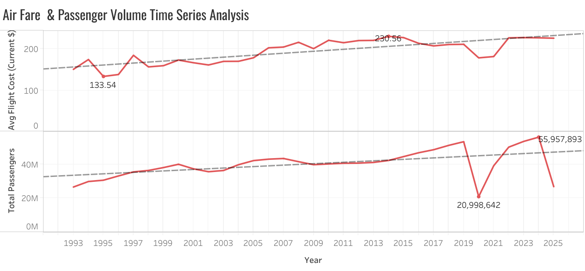

# U.S. Airline Fare Market Analysis
## Project Overview
This project analyzes trends in U.S. domestic airline ticket prices and passenger quantities by airline using data from the Bureau of Transportation Statistics.
The goal of this analysis is to explore how airline fares have changed over time -- compare pricing across airlines -- and examine the relationship between ticket prices, passenger volume, and airline revenue.
SQL was used to aggregate and analyze the dataset, and Tableau was used to visualize the results.

## Dataset
Source: Bureau of Transportation Statistics
Dataset: Average Air Fare by Carrier

Key fields include: 
- Year
- Carrier Name
- Average Market Fare
- Market Passengers
- Market Revenue
- Passenger Miles Flown
- Average Market Yield

## Tools Used
SQL (Google BigQuery) - Data aggregation and analysis
Tableau Public - Data visualisation

## Analytical Questions

1. How have airline ticket prices changed over time?
2. Which airlines charge the highest average fares?
3. Which airlines move the most passengers?
4. Which airlines generate the most revenue per mile?
5. Is there a relationship between fare prices and passenger volume?
6. Which airlines show the most stable pricing over time?

## SQL Analysis

The dataset was analyzed using SQL in Google BigQuery to answer the analytical questions listed above. Queries included aggregations, grouping by airline and year, and calculating derived metrics such as average fares and revenue per mile. 
All SQL quereies used in this project can be found here:
/sql/airline_queries.sql

## Visualizations
### Average Domestic Airline Fare (1993-2025)

  This visualization shows a gradual increase in airline fares from the 1990s to the mid-2010s, followed by a sharp drop in 2020 corresponding to the collapse in air travel demand during the COVID-19 pandemic. The pricing hit its peak in 2014, but has shown a surpising lack of fluctuation outside of the previously mentioned year due to Covid-19. Following 2020 prices were the least subject to fluctuation.
  The visualization underneath shows the trend of total passengers by year. The trend shows to be a rather consistent increase in passenger volume over time, with a steep drop off in 2025 possibly due to when the data was collected, possibly indicating incomplete data for that year. There is a striking relationship between the passenger volume and airline fares. Both charts show a stable trend upward, with a sharp spike down during 2020, which was consistent with what was expected. 

## Key Insights
- Airline fares show a long-term upward trend from the early 1990s until the mid 2010s.
- A significant drop in pricing occurs in 2020, corresponding to the drop in demand for travel during the COVID-19 pandemic.
- There is a significant correlation between volume of passengers and air fare trends, though their peaks do not line up. 
